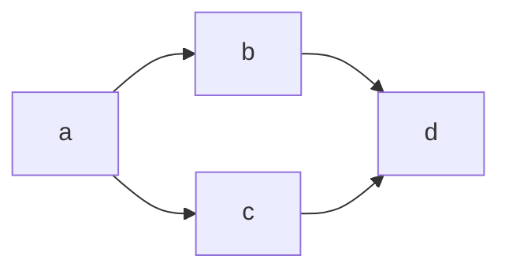
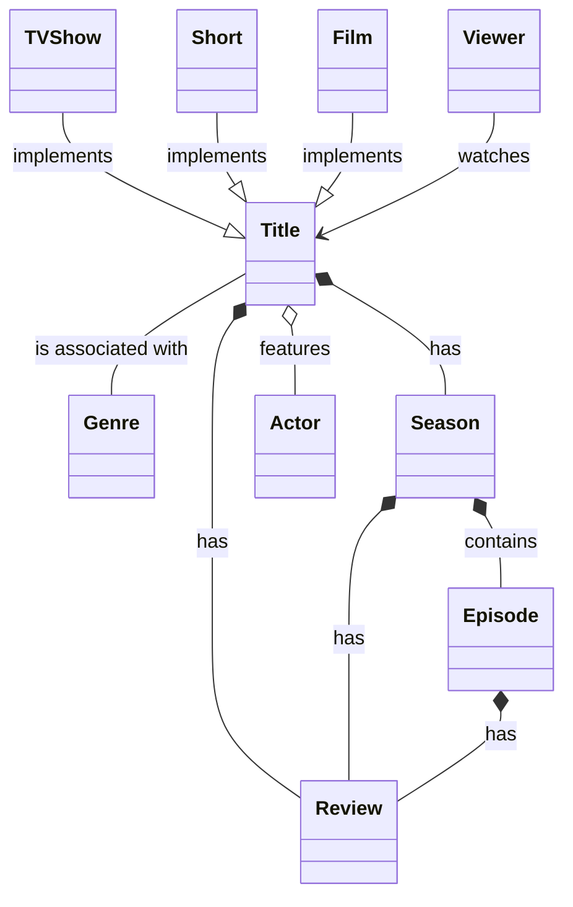
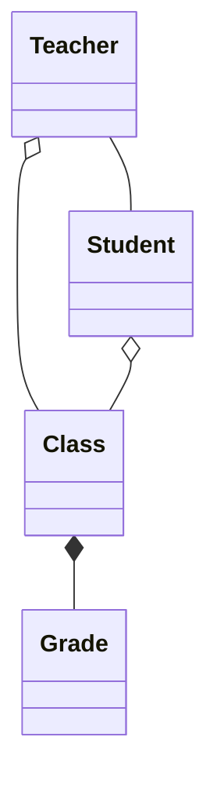

# Diagramming with Mermaid

Let's have some fun building diagrams.

Let's see if the system is working. A simple test diagram:

## How to create and document a domain  model

Markup legend for a `classDiagram`:
- `--` represents an association which depicts a link between two entities. Those entities can exist individually without knowing one about the other. Peer entities that might work together.
- `0--` represents an aggregation association. Entities linked by aggregation can still exist independently. But one is a parent which is linked to a child. If the parent entity is deleted, the child can still remain and live on independently.
- `*--` represents a composition association. Entities linked by composition have the closest relationship. Like aggregations, there is a parent. If the parent is deleted the child is also deleted. A child entity here makes no sense without a parent.
- `--|>` represents an inheritance association. It goes from the subclass to the template. 
- `:` can be used at the end of any of the above associations to add descriptions. Descriptions can be used on any flows through the diagram.
- `%%`  is used to comment lines of the diagram. Nice!

The above markup can be used to generate something like...

Let's try another one...

