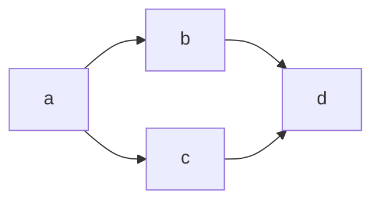
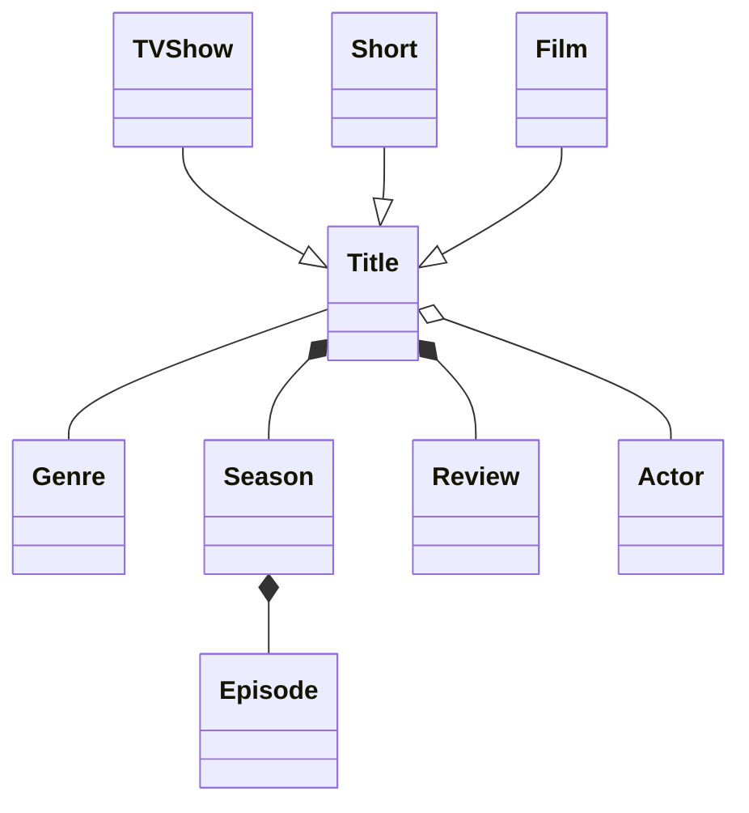
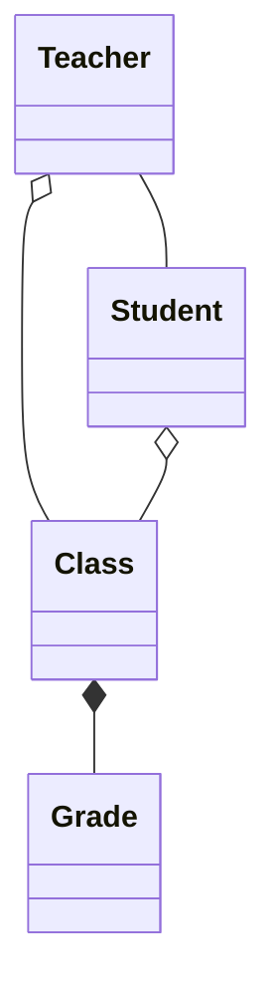

# Diagramming with Mermaid

Let's have some fun building diagrams.

Let's see if the system is working. A simple test diagram:

## How to create and document a domain  model

#### Let's try something else

