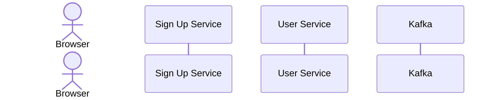

# Diagramming with Mermaid

Let's have some fun building diagrams.

Let's see if the system is working. A simple test diagram:

## How to create and document a domain  model

Markup legend for a `classDiagram`:
- `--` represents a bidirectional association between two entities. Those entities can exist individually without knowing one about the other. Peer entities that might work together and hold references from one to the other.
- `-->` represents a directional association between two entities. Those entities can exist individually without knowing one about the other. But in this case just one entity can hold a reference to the other entity. The other one can never hold a reference to the other entity.
- `0--` represents an aggregation association. Entities linked by aggregation can still exist independently. But one is a parent which is linked to a child. If the parent entity is deleted, the child can still remain and live on independently.
- `*--` represents a composition association. Entities linked by composition have the closest relationship. Like aggregations, there is a parent. If the parent is deleted the child is also deleted. A child entity here makes no sense without a parent.
- `--|>` represents an inheritance association. It goes from the subclass to the template. 
- `:` can be used at the end of any of the above associations to add descriptions. Descriptions can be used on any flows through the diagram.
- `"1"`, `"1..*"`, `"0..*"` are ways of adding multiplicity to the relationships. Known as cardinality. Use them on each side to annotate the diagram, or just on one side of the relationship. An entity’s cardinality is defined on the opposite side of the relationship, which can be confusing to begin with.
- `%%`  is used to comment lines of the diagram. Nice!
- `link NODE_NAME LINK_URL _blank` to generate a clickable link on the name of the entity.

The above markup can be used to generate something like...

### Streamy Domain Model

Let's try another one...

### School Domain Model

## How to visualise application and user flows

Markup legend for `sequenceDiagram`
- `actor` defines an actor. An actor represents a human user.
- `participant` defines a participant. A participant represents a process.

### User Signup Flow Diagram

