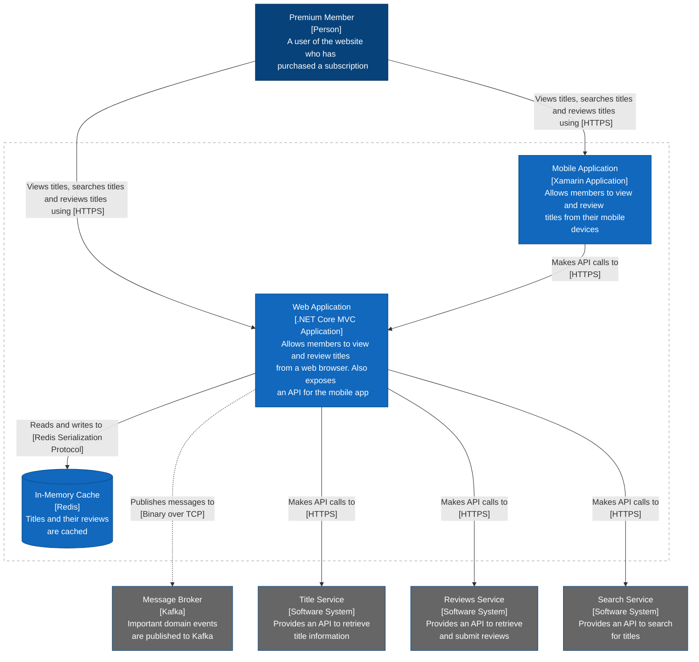
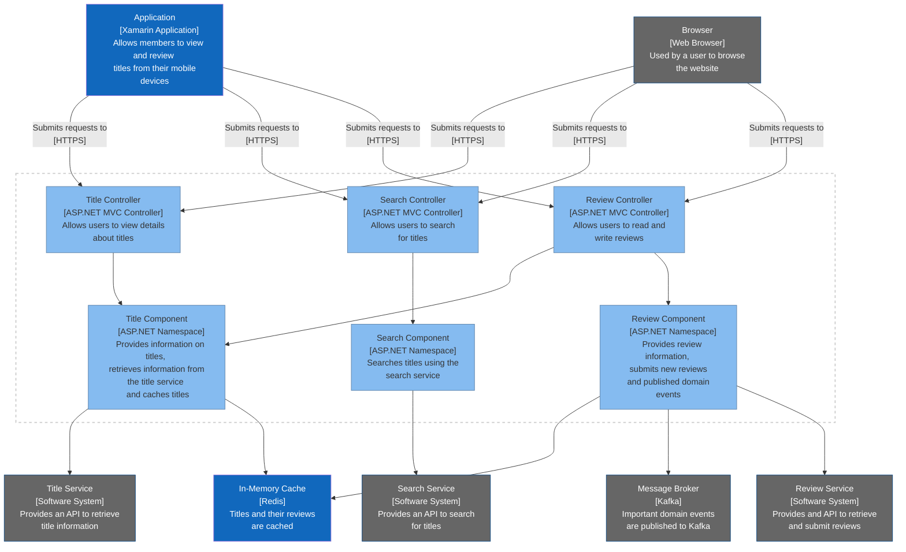
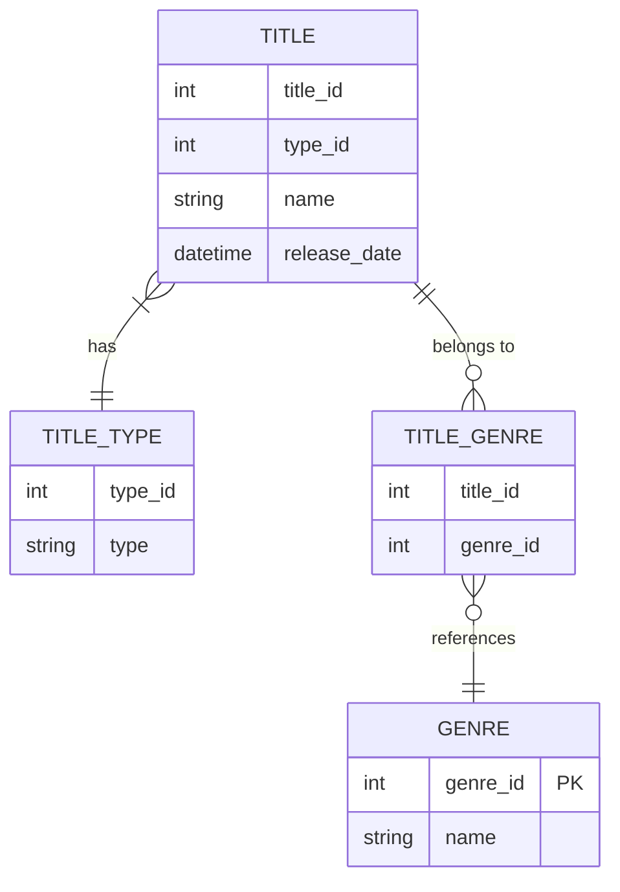

# Diagramming with Mermaid

Let's have some fun building diagrams.

Let's see if the system is working. A simple test diagram:

## How to create and document a domain  model

Markup legend for a `classDiagram`:

- `--` represents a bidirectional association between two entities. Those entities can exist individually without knowing one about the other. Peer entities that might work together and hold references from one to the other.
- `-->` represents a directional association between two entities. Those entities can exist individually without knowing one about the other. But in this case just one entity can hold a reference to the other entity. The other one can never hold a reference to the other entity.
- `0--` represents an aggregation association. Entities linked by aggregation can still exist independently. But one is a parent which is linked to a child. If the parent entity is deleted, the child can still remain and live on independently.
- `*--` represents a composition association. Entities linked by composition have the closest relationship. Like aggregations, there is a parent. If the parent is deleted the child is also deleted. A child entity here makes no sense without a parent.
- `--|>` represents an inheritance association. It goes from the subclass to the template. 
- `:` can be used at the end of any of the above associations to add descriptions. Descriptions can be used on any flows through the diagram.
- `"1"`, `"1..*"`, `"0..*"` are ways of adding multiplicity to the relationships. Known as cardinality. Use them on each side to annotate the diagram, or just on one side of the relationship. An entity’s cardinality is defined on the opposite side of the relationship, which can be confusing to begin with.
- `%%`  is used to comment lines of the diagram. Nice!
- `link NODE_NAME LINK_URL _blank` to generate a clickable link on the name of the entity.

The above markup can be used to generate something like...

#### Streamy Domain Model

Let's try another one...

#### School Domain Model

## How to visualise application and user flows

Sequence diagrams are high-level views of a process, so try to keep the labels high-level too.

Markup legend for `sequenceDiagram`:

- `autonumber` can be used to add numbers for the messages on the flow.
- `actor` defines an actor. An actor represents a human user.
- `participant` defines a participant. A participant represents a process. You can define aliases for participants like so `participant SUS as Sign Up Service`. When defining messages between participants, you can then use the shorter alias rather than its full name, which will still be rendered on the diagram.
- `->>` defines a synchronous interaction between two sequence diagram nodes which is a message. It is a request.
- `-->>` defines a reply message interaction. It is a response.
- `alt SOME_TAG_NAME` then `else TAG_NAME` and `end` to define branching logic in a diagram. You can use as many `else` as you need to define more branches.
- `--)` defines an asynchronous interaction between participants/actors.
- `activate PARTTICIPANT_NAME` with `deactivate PARTICIPANT_NAME` to define an activation that offers more insight at a glance on the diagram. Activations can also be defined by adding a `+` (activation) or `-` (deactivation) sign to the ends of the arrows.
- `Note [Left|Right] of NODE_NAME` to add a note on the diagram for a specific node.
- `links` can be used to add an active dropdown for each actor or participant.

#### User Signup Flow Diagram

## How to Model Your Architecture

Markup legend for `flowchart [TB|TD|BT|RL|LR]`

- `TB` is top to bottom
- `TD` is top down
- `BT` is bottom to top
- `RL` is right to left
- `LR` is left to right
- `NODE_NAME["Label/Description"]` defines a node. A node is defined once and used everywhere in the diagram.
- `ParentNode-- "arrow label" -->ChildNode` defines a flow between two nodes. The arrow label is optional.
- `ParentNode --> |"arrow label"| ChildNode` can also be used to define a flow between two nodes. This is useful when you want to add a description to the flow. The description will be rendered on the diagram.
- use `classDef className styleProperties` to define a class. You can then use `class` to apply the class to a node. You can define as many classes as you need.
- use `class nodeId(s) className` to apply a class to a node. You can define multiple classes on a single node by separating them with a comma.

## How to Map You System's Containers

A container is a single deployable unit. A container diagram shows interactions between containers rather than systems. They sho everything deployed for that system to function.

Markup legend for `flowchart [TB|TD|BT|RL|LR]` continued

- `subgraph id[Title]` closed with `end` allows defining sub-flows within the main flowchart.
- `style nodeId styleProperties` to style just a specific node.
- A variety of shapes besides rectangles and cylinders are available to use within flowcharts. The main other two are circles, which are formed using `id((label))`, and diamonds, formed using `id{label}`. A full list is available from Mermaid’s documentation
- If we add hyphens to all interactions at a given rank, Mermaid essentially “skips” a rank and simply fills the rank with an extended line. So use `--->` instead of `-->` for example.
- `ParentNode -. "arrow text" .-> ChildNode` to define a dashed line arrow. Other arrow types are:
  - `A–>B` for a link with arrowhead
  - `A– text –>B or A–>|text|B` for a link with Arrowhead with text
  - `A—B` for a link with No Arrowhead
  - `A– This is the text! —B or A— |This is the text|B` for a link with No Arrowhead and text
  - `A-.->B` for a dotted link
  - `A-. text .-> B` for a dotted link with text
  - `A ==> B` for a thick link with Arrowhead
  - `A == text ==> B` for a thick link with Arrowhead with text
  - `A– text –> B – text2 –> C` for chaining links
  - `A –> B & C–> D` for multiple links

## How to structure your components and code

A component here is the equivalent of a high-level namespace or module, or some sort of library or package that's included in the container.

## How to design database schemas

Markup legend for `erDiagram`:
- `ENTITY_NAME_1 CARDINALITY--CARDINALITY ENTITY_NAME_2: "LABELS GO HERE"` is the format foe defining relationships. The cardinality can be on of the following four:
  - `||` is exactly one
  - `}|` is one to many 
  - `o{` is zero to many

